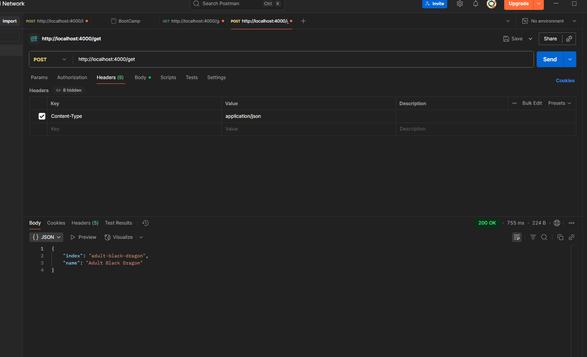
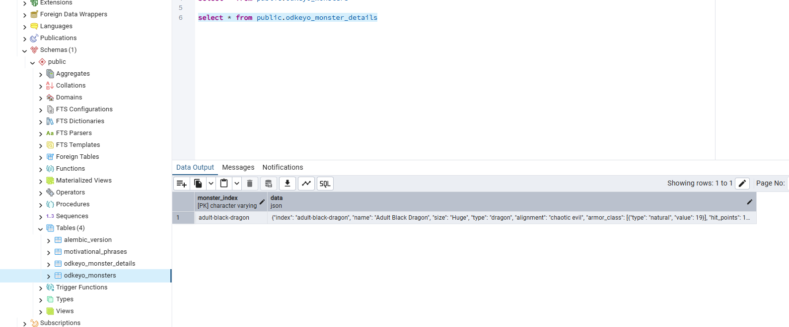
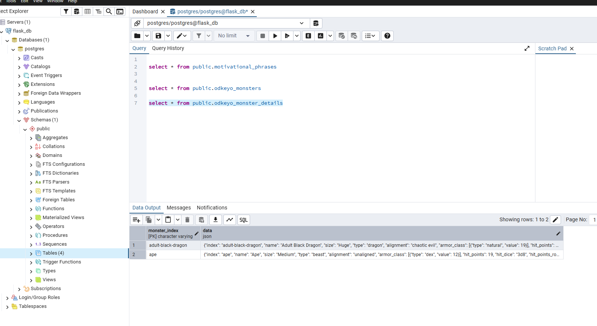

Endpoints

List Monsters
POST /list
Body:
{ "resource": "monsters" }

Response:
{
  "count": 325,
  "results": [
    { "index": "aboleth", "name": "Aboleth" },
    { "index": "acolyte", "name": "Acolyte" }
  ]
}

Get Monster Detail
POST /get
Body:
{ "monster_index": "adult-black-dragon" }

Response:
{
  "index": "adult-black-dragon",
  "name": "Adult Black Dragon",
  "data": {
    "size": "Huge",
    "type": "dragon",
    "alignment": "chaotic evil",
    "armor_class": 19,
    "hit_points": 195,
    "challenge_rating": 14,
    "...": "..."
  }
}

Technologies

Flask: Web framework for the endpoints.
SQLAlchemy: ORM for caching data in PostgreSQL.
Alembic: Database migrations.
Marshmallow: Input and output validation.
Requests: HTTP client for the D&D API.
Docker Compose: Orchestration of containers (Flask + Postgres).

File Structure
contributors/odkeyo/dnd/
  ├── clients.py   # HTTP client for the D&D API
  ├── main.py      # Flask handlers
  ├── schemas.py   # Marshmallow validation
  ├── service.py   # DB caching logic
  └── README.md    # (this file)
framework/
  ├── database.py  # DB configuration
  └── models.py  

How to Run
Build and start the services with Docker Compose:
docker compose up --build

Use Postman (or curl) to test the endpoints.
Validations

Input:

http://localhost:4000/list 
requiere { "resource": "monsters" }.

http://localhost:4000/get 
requiere { "monster_index": "<index>" }.

Output:

List always returns { "count", "results" }.
Get returns { "index", "name", "data" }.

Note for Windows Users

If you see this error when starting containers:

$'\r': command not found

It means the file run_local.sh has Windows line endings (CRLF) instead of Unix (LF).
Bash on Linux does not recognize \r and fails to execute the script.

Solutions

Quick fix in PowerShell (run once):

(Get-Content -Raw .\backend\run_local.sh).Replace("`r`n","`n") |
  Set-Content -NoNewline -Encoding ascii .\backend\run_local.sh

Configure Git to always save .sh files with LF line endings
Add a .gitattributes file at the root of the project:

*.sh text eol=lf

In VS Code
Open backend/run_local.sh, switch CRLF → LF (bottom-right corner), and save.

Evidence images:

